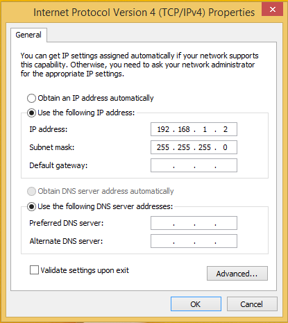
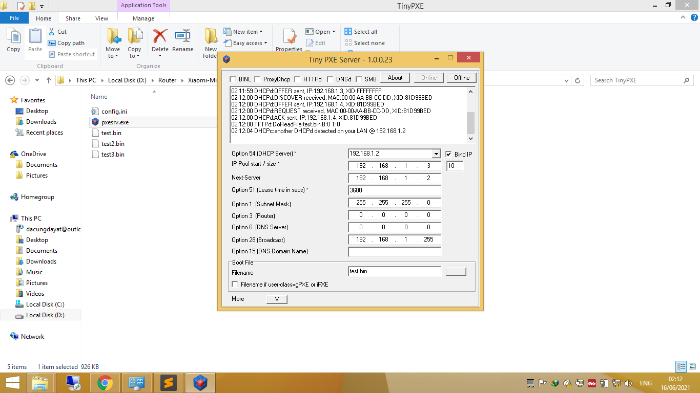

1. Download "tools debrick" sesuai type router lalu extract

    
  

2. Colok Adaptor router sambil tahan tombol reset pada ruter xiaomi sampai LED kedap kedip warna Orange baru lepas tombol reset

3. Colok LAN1 dr router xiaomi ke laptop

4. Buka tools debrick dan pastikan DHCP LAN sudah terdeksi benar menjadi "192.168.1.2" kemudian klik "online"

    
  

